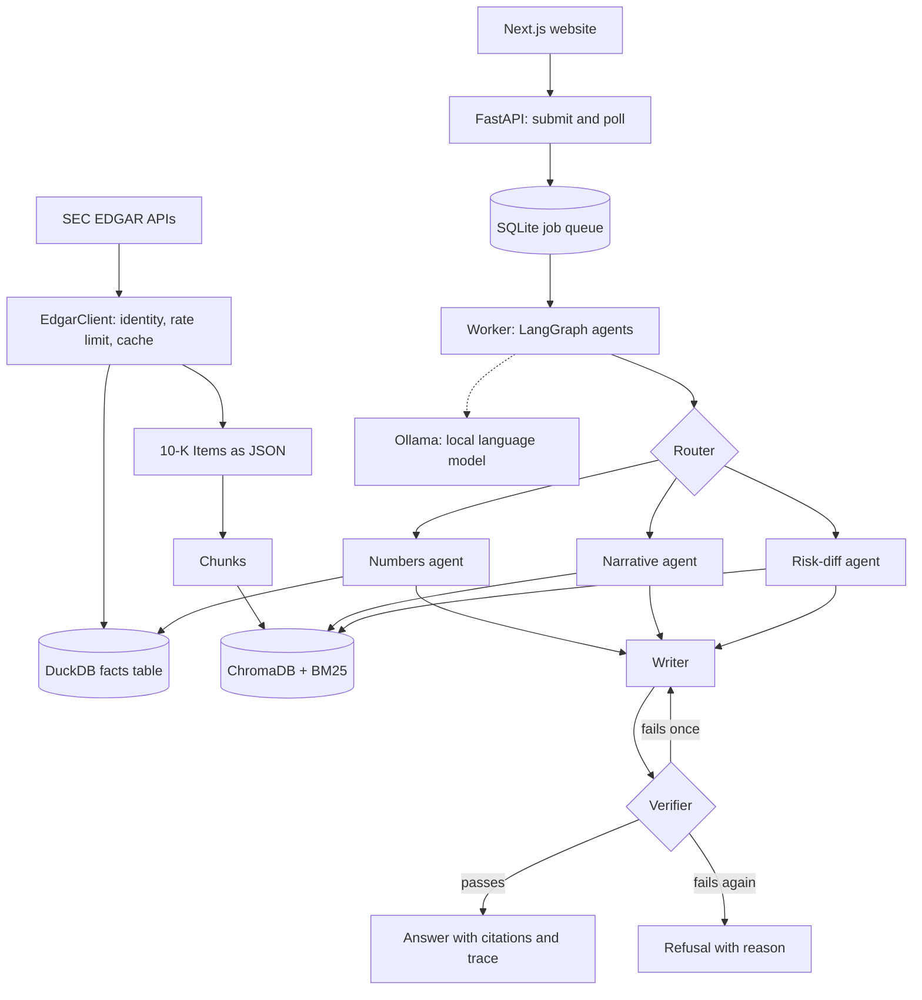

# Architecture

A modular monolith: one Python package, one API process, one background worker, one local model server. Nothing here needs microservices.

## Components



## Stack choices

| Layer | Choice | Alternative considered | Why not the alternative |
| --- | --- | --- | --- |
| Language | Python 3.12 | 3.13 or 3.14 | ML libraries lag behind the newest Python releases |
| Filing text | edgartools | Parsing SEC HTML myself | Item splitting is solved; I keep my own client for facts and caching |
| Numbers store | DuckDB | Postgres | Single file, fast analytical SQL, no server to run |
| Vector store | ChromaDB | FAISS | Chroma keeps metadata next to vectors and persists to disk |
| Embeddings | bge-small-en-v1.5 | bge-base or larger | Runs on CPU; move up only if retrieval measurements say so |
| Keyword search | rank-bm25 | Vectors only | Exact terms such as "goodwill impairment" and Item names need word matching |
| Orchestration | LangGraph | A hand-written loop | The retry edge and per-step state are explicit and traceable |
| Language model | Ollama with qwen2.5:7b | Paid APIs | Zero budget, reproducible, nothing leaves the machine |
| API | FastAPI | Flask | Pydantic validation built in; same submit/poll pattern as SupportSense |
| Job queue | SQLite | Redis with Celery | One machine and one worker; Redis would add a server for nothing |
| Website | Next.js with Tailwind CSS | Streamlit | Full control over design, which the site rules require |

## Folder structure

```
tickandtie/
  config.py        settings from .env, company list, predecessor CIKs
  ingest/          SEC client, 10-K Items, XBRL facts
  index/           chunking, vector and keyword indexes (Task 3)
  agents/          router, numbers, narrative, risk-diff, writer, verifier (Task 4)
  api/             FastAPI app and worker (Task 7)
scripts/           pipeline scripts, run with python -m scripts.<name>
tests/             unit tests, no network
eval/              question set and evaluation harness (Task 5)
web/               Next.js site (Task 8)
docs/              design, architecture, decisions
data/              everything rebuildable from the SEC; never committed
```

## Background work
Answering a question runs in a single worker that reads jobs from SQLite, one at a time, because the model shares one small GPU. Jobs are keyed by id, so running one twice gives the same result. A failed model call is retried once, and failures stay visible through the job status.

## Outside services
| Service | Used for | Cost |
| --- | --- | --- |
| SEC EDGAR | Filings and XBRL facts | Free (fair-access rules) |
| GitHub | Code and CI | Free |
| Hugging Face | One-time embedding model download | Free |
| Hosting | Decided in Task 9 | Aim: free |
| Domain | Custom domain at launch | About 10 to 15 euros a year |

## Riskiest decisions
1. **A local 7B model.** Answer quality and speed on a 4 GB GPU are unproven, and free hosting for it is unlikely. Mitigation: measure in Task 5, keep a smaller model as a fallback, settle hosting in Task 9.
2. **Relying on edgartools to split Items.** It already failed on 2 of 36 reports. Mitigation: per-report quality warnings, tests, and known gaps recorded rather than hidden.
3. **Mapping questions to XBRL concepts.** Companies switch concepts and some report two revenue figures, so a wrong mapping would give a confident wrong answer. Mitigation: the answer names the concept it used, the verifier checks it, and evaluation covers all 12 companies.